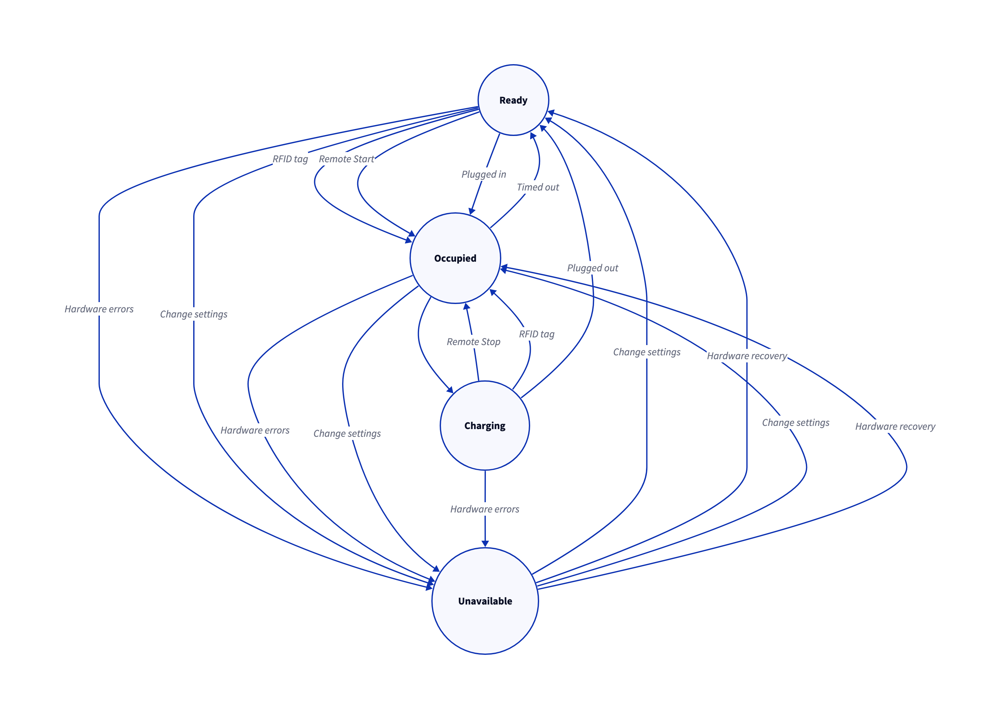

## Charging Station

| input / state     | Ready       | Occupied         | Charging    | Unavailable |
| ----------------- | ----------- | ---------------- | ----------- | ----------- |
| Plugged In        | Occupied    | -                | -           | -           |
| Plugged Out       | -           | Ready            | Ready       | -           |
| RFID Tag          | - / Occupied| - / Charging     | - / Occupied| -           |
| Remote Start      | Occupied    | - / Charging     | -           | -           |
| Remote Stop       | -           | -                | Occupied    | -           |
| Timed Out         | -           | - / Ready        | -           | -           |
| Hardware Errors   | Unavailable | Unavailable      | Unavailable | -           |
| Hardware Recovery | -           | -                | -      | Ready / Occupied |

- `-/Occupied` or `-/Charging` indicates to stay in the current state or transition to the next state
    - For example, if RFID tagged in the `Occupied` state:
        - If authorization is successful while plugged in, transition to `Charging` state
        - Otherwise, stay in current state
- States
	- Ready
	- Occupied
        - `Charging` can only happen in `Occupied`, so it would be nice to have a more independent term than `Occupied`. Need to include preparing and finishing states
	- Charging
        - Suspended and finished charging are also included in this state
	- Unavailable
        - Emergency button also included in this state.

### Diagram

### State Transition Table

| Current state | Event             |  Action     | Prev. state | Next state     |
| ------------- | ----------------- |  ---------- | ----------- | -------------- |
| Ready         | Plug in           |  -          | -           | Occupied       |
| Ready         | Remote start      |  TimerStart | -           | Occupied       |
| Ready         | RFID tag          |  TimerStart | -           | Occupied       |
| Occupied      | Plug in           |  RelayOn    | -           | Charging       |
| Occupied      | Remote start      |  RelayOn    | -           | Charging       |
| Occupied      | RFID tag          |  RelayOn    | -           | Charging       |
| Occupied      | Timed out         |  -          | Ready       | Ready          |
| Occupied      | Fail/Not accepted |  -          | Ready       | Ready          |
| Occupied      | Plug out          |  -          | -           | Ready          |
| Charging      | Remote stop       |  RelayOff   | -           | Occupied       |
| Charging      | RFID tag          |  RelayOff   | -           | Occupied       |
| Charging      | SuspendedEV       |  RelayOff   | -           | Charging       |
| Charging      | Resume suspended  |  RelayOn    | Charging    | Charging       |
| Charging      | Plug out          |  RelayOff   | -           | Ready          |
| Ready         | Hardware errors   |  -          | -           | Unavailable    |
| Occupied      | Hardware errors   |  -          | -           | Unavailable    |
| Charging      | Hardware errors   |  -          | -           | Unavailable    |
| Unavailable   | Hardware recovery |  -          | Ready       | Ready          |
| Unavailable   | Hardware recovery |  -          | Occupied    | Occupied       |
| Unavailable   | Hardware recovery |  -          | Charging    | Occupied       |
